# 📖 API Help Chatbot

An intelligent chatbot designed to provide **API help documentation** instantly. This bot integrates with **Google Drive**, **Pinecone**, **OpenAI**, and **Telegram** using an **n8n automation pipeline**.

## 🚀 Features
- 📂 Fetches API help files stored in **Google Drive**
- 🔍 Converts documents into embeddings using **OpenAI**
- 📊 Stores and searches embeddings efficiently with **Pinecone Vector DB**
- 🤖 Uses **OpenAI Chat Model** to generate natural language answers
- 🔗 Automated workflows managed via **n8n**
- 💬 Seamless **Telegram Bot integration** for end-user interaction

## 🛠️ Tech Stack
- **n8n** — Workflow automation for orchestrating tasks
- **OpenAI** — Embeddings & chat-based responses
- **Pinecone** — Vector database for semantic search
- **Telegram Bot API** — Messaging and triggers
- **Google Drive API** — Document storage and retrieval

## ⚙️ Architecture Flow

### 🔹 Workflow Diagram (Mermaid)

```mermaid
flowchart TD
    A[📂 Google Drive API] -->|Fetch Help Docs| B[n8n Workflow]
    B -->|Convert to Embeddings| C[🔎 OpenAI Embeddings]
    C -->|Store & Search| D[📊 Pinecone Vector DB]
    D -->|Retrieve Relevant Context| E[🤖 OpenAI Chat Model]
    E -->|Answer Generated| F[💬 Telegram Bot]
```


### 🔹 ASCII Flow
```
[Google Drive Docs] --> [n8n Workflow] --> [OpenAI Embeddings] --> [Pinecone Vector DB]
                                                                    |
                                                                    v
                                                         [OpenAI Chat Model] --> [Telegram Bot]
```

## 📦 Setup Instructions

### 1) Clone Repository
```bash
git clone https://github.com/your-repo/api-help-chatbot.git
cd api-help-chatbot
```

### 2) Environment Variables
Create a `.env` file in the project root and configure the following:
```
OPENAI_API_KEY=your_openai_key
OPENAI_EMBEDDING_MODEL=text-embedding-3-small
PINECONE_API_KEY=your_pinecone_key
PINECONE_ENVIRONMENT=your_pinecone_env
PINECONE_INDEX=api-help-chatbot
GOOGLE_DRIVE_API_KEY=your_gdrive_key
TELEGRAM_BOT_TOKEN=your_telegram_bot_token
```

### 3) Setup n8n
1. Install n8n (Docker, desktop, or self-hosted).
2. Import the provided workflow JSON: `workflows/api_help_chatbot.json`.
3. Configure credentials for **Google Drive**, **Pinecone**, **OpenAI**, and **Telegram** within n8n.

### 4) Deploy Pinecone Index
- Create an index (e.g., `api-help-chatbot`).
- Set the **dimension** to match your embedding model (e.g., `1536` for `text-embedding-3-small`).

### 5) Run the Bot
Start n8n:
```bash
n8n start
```
Send a message to your **Telegram bot**, and it will reply with API help answers.

## 📌 Example Usage
- **User (Telegram):** “How do I authenticate with the API?”  
- **Bot:** Searches embeddings in Pinecone → Finds relevant docs → Generates response using OpenAI → Replies with explanation.

## 🧩 How It Works (Step-by-Step)
1. **Google Drive** stores your API help docs (PDF, DOCX, TXT, MD).
2. **n8n** fetches files and text content via Google Drive nodes.
3. **OpenAI Embeddings** convert text chunks into vectors.
4. **Pinecone** stores vectors and performs semantic similarity search.
5. **OpenAI Chat Model** uses retrieved context to generate answers.
6. **Telegram Bot** sends the answer back to the user.

## 🛠️ Troubleshooting
- **No results returned:** Ensure documents are shared/accessible via the credentials used in n8n.
- **Dimension mismatch error:** Verify Pinecone index dimension equals the embedding model output size.
- **Bot not responding:** Check Telegram bot token and webhook settings inside n8n.
- **Docs not updated:** Re-run the ingestion workflow when adding/updating files in Google Drive.

## 🔮 Future Enhancements
- Multi-language support
- Slack / Teams / WhatsApp channels
- Response caching for popular queries
- Admin dashboard for monitoring and document updates

## 👨‍💻 Author
Built by **Your Name** using automation, AI, and messaging.
